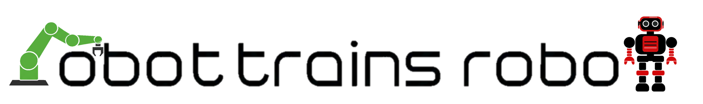
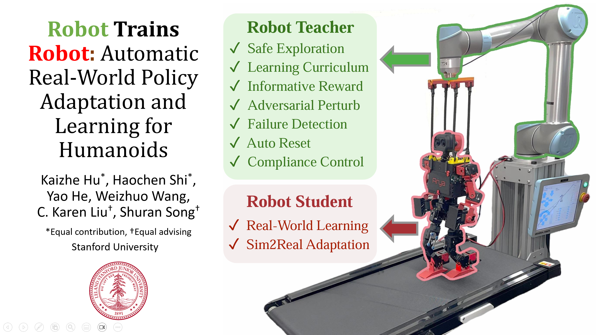

**[Paper](https://arxiv.org/abs/2502.00893)** |
**[Website](https://robot-trains-robot.github.io/)** |
**[Video](https://youtu.be/MhwVx_mlm6Q)** | 
**[Tweet](https://x.com/HaochenShi74/status/1886599720279400732)** |

Robot-Trains-Robot (RTR) is a novel framework where a robotic arm teacher actively supports and guides a humanoid robot student. The RTR system provides protection, learning
schedule, reward, perturbation, failure detection, and automatic resets. It enables efficient long-term real-world humanoid training with minimal human intervention. 

## Setup
Our setup overall is similar to [todderbot](https://toddlerbot.github.io/). 
For ubuntu system, install  via the following steps:

### Set up the Repo
Run the following commands to clone the repo:

```
mkdir ~/projects
cd ~/projects
git clone git@github.com:hukz_18/robot_trains_robot.git
cd robot_trains_robot
git submodule update --init --recursive
```

### Install Miniforge
If conda is not installed yet, we recommend installing Miniforge.

Run the following commands to determine your system architecture:

```
uname -m
```

Based on your system architecture, download the appropriate Miniforge installer. For example, for a Linux machine with arm64 architecture, download Linux aarch64 (arm64) from their website. Do NOT run the install script with sudo. Answer yes to all the options.

Restart your terminal to activate the conda environment.

### Set up Conda Environment (Linux)
```
mamba create --name rtr python=3.10
conda activate rtr
pip install -e toddlerbot/brax
pip install -e toddlerbot/rsl_rl
pip install -e ".[linux]"
```
### Hardware

**Toddlerbot**: follow the guidline from [todderbot](https://toddlerbot.github.io/) to setup the robot.

**F/T sensor**: lease follow the [manual](https://www.ati-ia.com/app_content/documents/9610-05-1022.pdf) starting from page 19 to setup the F/T sensor communication, and configure the ip to 192.168.2.1. (Mount: TODO)
  
**UR5**: Download the driver from [hardware-interface](https://github.com/hukz18/hardware_interfaces) and build it. Configure the ip.

## Walkthrough
### Pretraining Walking Policy
The following command execute the training procedure presented in section 3.1 in the paper.
Please first config wandb to log your results. For example, you may need to setup the "WANDB_USERNAME" environment variable.
#### Stage 1 Training
```
python -m toddlerbot.locomotion.train_mjx --tag <your tag>
```
This command will generate a subfolder under `results` folder, with name like `toddlerbot_2xm_walk_ppo_yyyymmdd_hhmmss_<your tag>`, contain all running results of that stage 1 training run.
You can verify that the `eval/mean_reward` raise to around 300 at the end of training (around 5k steps), while the `eval/mean_reward_zero_z` score remains low, typically under 50. The later metric measures the policy's performance when the dynamics latent is set to all zero, verifying the policy indeed learns to make use of the latent.

#### Stage 2 Training
```
python -m toddlerbot.locomotion.train_mjx --tag <the same tag as that above> --optimize-z --restore <yyyymmdd_hhmmss> # timestamp output from stage 1
```

In this stage, the policy network is freezed and only the dynamics latent is optimized, because the universal latent is intialized from the average of all environment latents, the initial performance will drop to zero but it will increase quickly, reaching around 300 in less than 300 steps.

In addition, we have provided our pretrained checkpoint [here](https://drive.google.com/drive/folders/1qed0Z1NnnXZMky64C3kU6-Oziqq3QDdR). You can download the checkpoint and place it under **results** folder.
 
### Real-world Training
An examplar execution process is presented in the [launch](https://github.com/shockwaveHe/Robot-Trains-Robot/tree/rtr/launch) folder. Please make sure that the robot, computer and remote learner are under the same network.

Before running the experiments, start the hardware driver by running
```
cd force_ctl/hardware_interfaces/build/applications/force_control_demo
./force_control_<task> # task could be chosen from [swing, walk]
```

### Real-world Adaptation for Walking Policy (Pretrain Needed)
On computer, run the script to control the arm and treadmill
```
python -m toddlerbot.policies.run_policy --policy at_leader --sim finetune --ip <your robot ip> 
```
On robot, run the finetune script
```
python toddlerbot/policies/run_policy.py --sim real --ip <your computer ip> --policy walk_finetune --robot toddlerbot_2xm  --ckpt <pretrained checkpoint>
```
On remote learner, run the remote learning script
```
python toddlerbot/policies/run_policy.py --policy walk
```
### Real-world Learning from Scratch for Swing-up Policy (No Pretrain)
On computer, run the script to control the arm
```
python toddlerbot/policies/run_policy.py --policy swing_arm_leader --ip <your robot ip> --robot toddlerbot_2xm
```
On robot, run the script to learn the swing-up policy
```
python toddlerbot/policies/run_policy.py --sim real --ip <your computer ip> --policy swing --robot toddlerbot_2xm --no-plot
```

## Citation
If you use RTR for published research, please cite:
```
@inproceedings{hu2025robot,
    title={Robot Trains Robot: Automatic Real-World Policy Adaptation and Learning for Humanoids},
    author={Hu, Kaizhe and Shi, Haochen and He, Yao and Wang, Weizhuo and Liu, C. Karen and Song, Shuran},
    booktitle={Conference on Robot Learning (CoRL)},
    year={2025}
}
```

## License  

- The RTR codebase (including the documentation) is released under the [](LICENSE).
